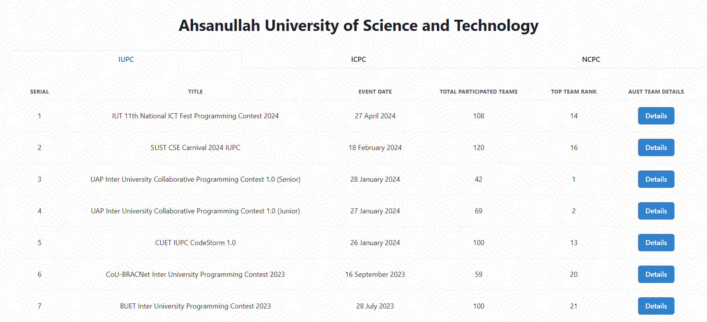
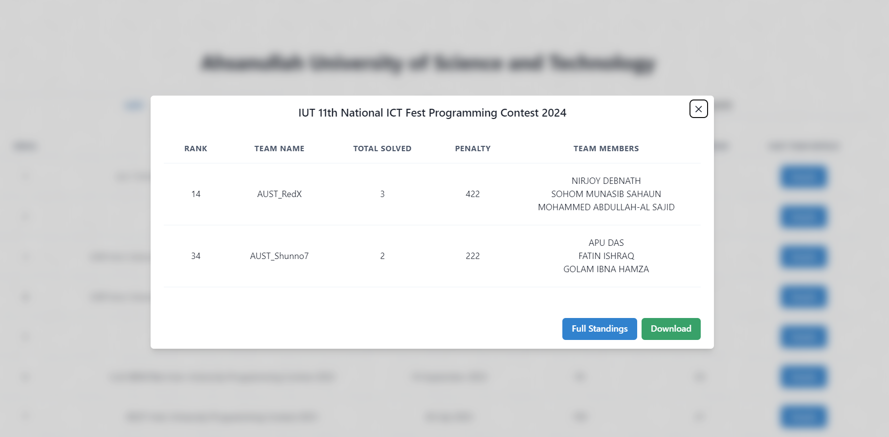
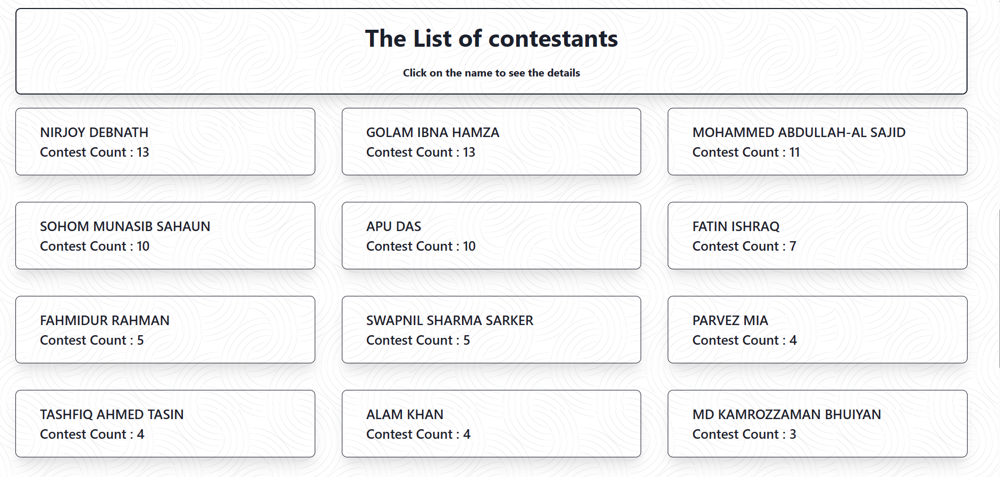

<h1 align="center">Programming Contest Tracker</h1>
<h2 align="center">Tracks the performances of AUST's Team in various Programming Contest. </h2>

<div align="center">
  <a href="https://wakatime.com/badge/github/piru72/PC_TRACKER">
    
  </a>
</div>

# Installation

If you want to run the project locally, you can follow the following steps:

## Using npm

```pwsh
git clone https://github.com/piru72/pc-tracker.git
cd pc-tracker
npm install
npm run dev
```

## Using Docker

```pwsh
git clone https://github.com/piru72/pc-tracker.git

cd pc-tracker
docker compose up -d
```

# Usage

As the project is mainly for the AUST Programming Contest Teams, the project is used to keep track of the performances of the team members in IUPC , ICPC ,NCPC. The project is hosted on vercel and can be accessed by the following link: https://aust-pc-tracker.vercel.app/

# Features

## Summary of the contests


## The details of the contests for downloading



## The list of contestants



## The details of the contestants


# License

This project is licensed under the GNU Affero General Public License v3.0. See the [LICENSE](LICENSE) file for details.

# Contributing

We welcome contributions from the community! Please see our [CONTRIBUTING.md](CONTRIBUTING.md) for guidelines on how to contribute.

# Acknowledgements

We would like to thank the AUST programming teams for their hard work and dedication. Special thanks to Vercel for hosting the project.
