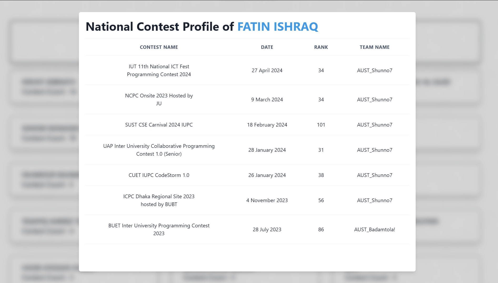

[](https://wakatime.com/badge/github/piru72/PC_TRACKER)

# Programming Contest Tracker

This project keeps tracks the performances of the Programming Contest of AUST's Team. It is a simple project that uses React and ChakraUi as the frontend. The project is hosted on vercel.

# Technologies
- React
- ChakraUi
- Vercel
- Python

# Installation


If you want to run the project locally, you can follow the following steps:

## Using npm
```pwsh
git clone https://github.com/piru72/PC_TRACKER.git
cd PC_Tracker
npm install
npm run dev
```

## Using Docker
```pwsh
git clone https://github.com/piru72/PC_TRACKER.git

cd PC_Tracker
docker compose up -d
```

# Usage

As the project is mainly for the AUST Programming Contest Teams, the project is used to keep track of the performances of the team members in IUPC , ICPC ,NCPC. The project is hosted on vercel and can be accessed by the following link: https://aust-pc-tracker.vercel.app/ 

# Features
## Summary of the contests


## The details of the contests for downloading


## The list of contestants


## The details of the contestants


# Contributing

If you want to contribute to the project, you can follow the following steps:


## Creating a new feature
1. Fork the project
2. Clone the project
3. Create a new branch
4. Make your changes
5. Push the changes
6. Create a pull request
7. Wait for the approval

## Adding a new contest
1. Fork the project
2. Clone the project
3. Go to public/data/data.csv file
4. Add the new contest details
5. Push the changes
6. Create a pull request
7. Wait for the approval


# License
This project is licensed under the MIT License. See the LICENSE file for details.

# Acknowledgements
We would like to thank the AUST programming teams for their hard work and dedication. Special thanks to Vercel for hosting the project.